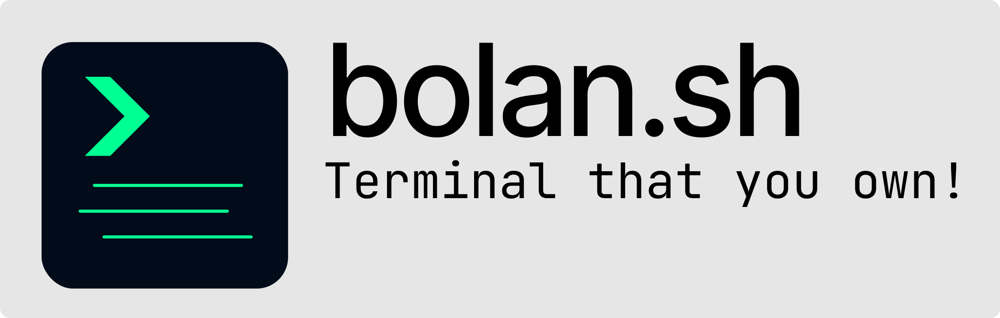

<p align="center">
  
</p>

<p align="center">
  An open-source terminal for macOS and Linux with AI built in.
</p>

<p align="center">
  <a href="https://github.com/azeemhassni/bolan.sh/releases/latest"></a>
  <a href="https://github.com/azeemhassni/bolan.sh/issues"></a>
  <a href="https://github.com/azeemhassni/bolan.sh/stargazers"></a>
  <a href="https://github.com/azeemhassni/bolan.sh/blob/main/LICENSE"></a>
  <a href="https://github.com/azeemhassni/bolan.sh/releases/latest"></a>
</p>

<p align="center">
  <a href="https://github.com/azeemhassni/bolan.sh/releases/latest">
    
  </a>
  &nbsp;
  <a href="https://github.com/azeemhassni/bolan.sh/releases/latest">
    
  </a>
  &nbsp;
  <a href="https://github.com/azeemhassni/bolan.sh/releases/latest">
    
  </a>
</p>

---

I started this because I used Warp and liked it, but I didn't like the deal: turn off telemetry and you lose every AI feature. There's no way to use the nice stuff without sending your data through their servers. Warp is closed source, so you either trust it or you don't.

Bolan is what I wanted instead. Same block-based output. AI features that can run fully local. Open source, so you can read what it does with your data (nothing, unless you point it at a cloud provider yourself).

Early and a bit rough. I use it every day.

## Features

- Block-based output with ANSI colors, collapsible, copy button
- `# natural language` generates shell commands
- `git commit` without `-m` generates the commit message
- AI command suggestions as ghost text after each command
- AI theme generator from a text description
- Error explanation on failed commands
- Workspaces with isolated env vars, git identity, history, config, and theme
- Split panes, tabs, drag to reorder
- Ctrl+R history search, ghost text from history while typing
- Tab completion for files, commands, git, npm, composer, artisan
- Git branch and dirty state in the prompt
- Cmd/Ctrl+hover file paths to open them
- Cmd+F find with regex across blocks
- 11 built-in themes, custom TOML themes, AI-generated themes
- Auto-updates with signature verification and rollback

## Getting started

macOS needs Xcode 15+ and CocoaPods. Linux needs clang, cmake, ninja-build, libgtk-3-dev, pkg-config.

Both need [Flutter](https://flutter.dev) 3.28+ (stable channel).

```bash
git clone https://github.com/AzeemHassni/bolan.sh
cd bolan.sh
flutter pub get
flutter run -d macos    # or: flutter run -d linux
```

Release builds:

```bash
flutter build macos     # -> build/macos/Build/Products/Release/Bolan.app
flutter build linux     # -> build/linux/x64/release/bundle/
```

Or grab a DMG/tar.gz from the [releases page](https://github.com/AzeemHassni/bolan.sh/releases).

## AI providers

All optional. The terminal works fine without any of this.

| Provider | What you need |
|---|---|
| Local | Nothing. Pick a model size in settings, it downloads. No keys, no account, stays on your machine. |
| HuggingFace | Free HuggingFace token. Kimi-K2 by default, also has DeepSeek-R1, Llama 3.3, etc. |
| Claude Code | Anthropic Pro/Max subscription |
| Google | API key from Google AI Studio |
| OpenAI | API key |
| Anthropic | API key |
| Ollama | Your own Ollama server, any model you've pulled |

## Config

`~/.config/bolan/` has everything:

```
config.toml                       # settings
themes/*.toml                     # custom themes
workspaces.toml                   # workspace list
workspaces/<id>/config.toml       # per-workspace settings
workspaces/<id>/history           # per-workspace history
workspaces/<id>/session_state.json # saved tab layout
```

Settings UI: Cmd+, (macOS) or Ctrl+, (Linux). There's a "Restore All Settings to Defaults" button if you break something.

## Shortcuts

| | |
|---|---|
| Cmd/Ctrl+T | New tab |
| Cmd/Ctrl+W | Close tab |
| Cmd/Ctrl+Shift+{ / } | Switch tabs |
| Cmd/Ctrl+D | Split right |
| Cmd/Ctrl+Shift+D | Split down |
| Cmd/Ctrl+Shift+W | Close pane |
| Cmd/Ctrl+Option+Arrows | Navigate panes |
| Cmd/Ctrl+\ | Workspace sidebar |
| Cmd/Ctrl+K | Clear |
| Cmd/Ctrl+F | Find |
| Cmd/Ctrl++/- | Font size |
| Ctrl+R | History search |
| `# ` + Enter | AI command |

## Contributing

PRs and bug reports welcome. If there's something you want, open an issue.

## License

MIT
